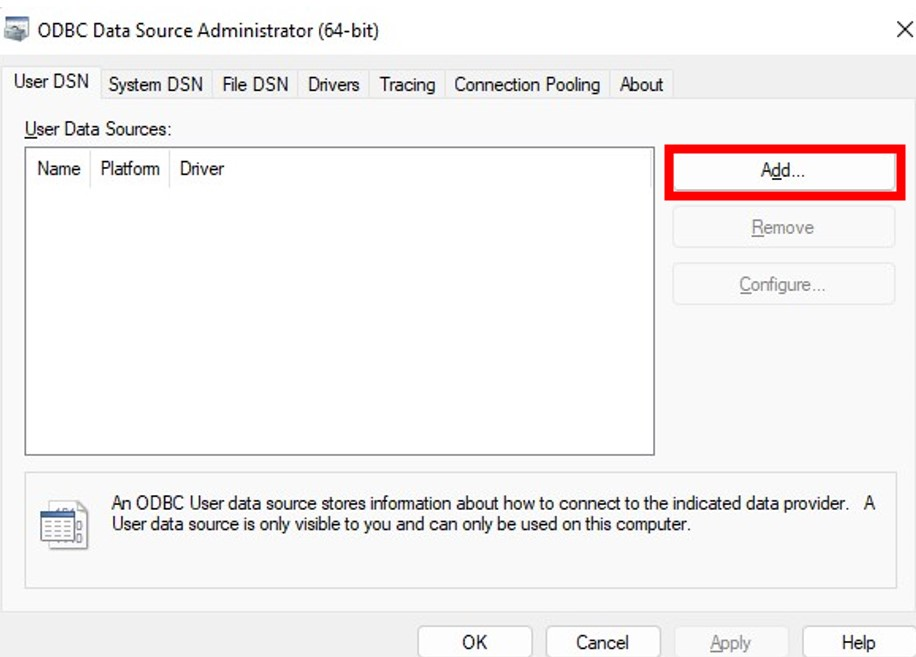
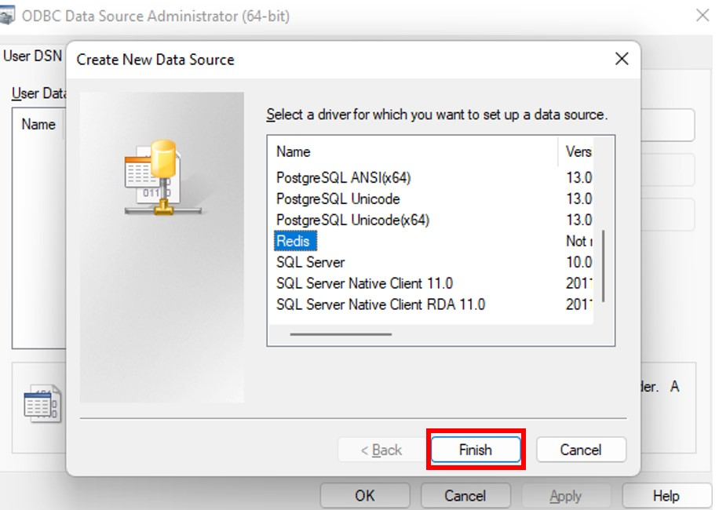
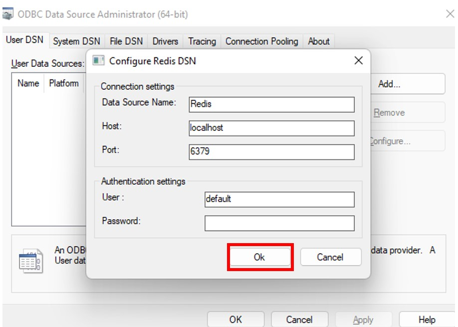

:linkattrs:
:project-owner:     redis-field-engineering
:project-name:      redis-sql-odbc
:project-version:   0.0.2
:name:              Redis SQL ODBC

++++
<p align="center">
  
  <p align="center">
    Redis SQL ODBC is a SQL interface for <a href='https://redis.io/docs/stack/'>Redis Stack</a>, <a href='https://redis.com/redis-enterprise-cloud/overview/'>Redis Cloud</a>, and <a href='https://redis.com/redis-enterprise-software/overview/'>Redis Enterprise</a>.
  </p>
</p>
++++

'''

{name} lets you easily integrate Redis with visualization frameworks and BI platforms (e.g., Power BI) and with systems that support the https://en.wikipedia.org/wiki/Open_Database_Connectivity[ODBC] standard.

Query support includes SELECT statements across secondary indexes covering Redis hashes and JSON objects. You can run filters (full text search, exact text matching, numeric ranges), apply functions (arithmetic, timestamp parsing, string formatting, calculate geodistances), reduce and summarize data (averages, summations, min, max, etc.), group data, order it, and more.

ODBC is a standardized way for clients to communicate with databases. Previous Redis ODBC connectors have been implemented using Redis keyspace scans, which are inefficient. This Redis ODBC connector provides fast queries by levereging the secondary indexing that comes with https://redis.io/docs/stack/search/[Redis Stack].

== Table of Contents

* link:#background[Background]
* link:#requirements[Requirements]
* link:#quick-start[Quick Start]
* link:#installation[Installation]
* link:#support[Support]
* link:#copyright[Copyright]

== Background

Redis is an in-memory data store designed to serve data with the fastest possible response times.
Redis is frequently used for caching OLTP-style application queries and as a serving layer in data pipeline architectures (e.g., lambda architectures, online feature stores, etc.).
Redis Stack is an extension to Redis that, among other things, lets you index your data on secondary attributes and then efficiently query it using a custom query language.

We built {name} to let you query Redis using SQL through ODBC. For example, {name} lets you read data for business intelligence tools such as Power BI.

++++
<p align="center">
    Using Redis SQL ODBC, PowerBI, and <a href='https://redis.io/docs/stack/'>Redis Stack</a> to build
    a dashboard for UFO sightings in Florida.
  </p>
<p align="center">
  
</p>

++++

== Requirements

{name} requires a Redis Deployment that includes https://redis.io/docs/stack/search/[RediSearch].

Redis deployments that bundle RediSearch include:

* https://redis.com/try-free/[Redis Cloud]: Fully-managed, enterprise-grade Redis deployed on AWS, Azure, or GCP.
* https://redis.com/redis-enterprise-software/overview/[Redis Enterprise]: Enterprise-grade Redis for on-premises and private cloud deployments.
* https://redis.io/docs/stack/[Redis Stack]: Redis distribution that includes RediSearch, RedisJSON, RedisGraph, RedisTimeSeries, and RedisBloom.

== Quick Start

This repo includes a demo to get you started. To run the demo, you'll need:

* Docker (with Linux Containers if using Windows).

To start the demo, run the following commands:

. `docker-compose -f demo/docker-compose.yaml build`
. `docker-compose -f demo/docker-compose.yaml up -d`
. `docker exec -it odbc isql -k "DSN=Redis;host=redis;"`

== Installation

To install {name}, you need to:

1. Install the driver itself.
2. Configure the driver's data source.

To install the driver, first download the installer.

=== Download the installer

Fetch the installer zipfile from the https://github.com/redis-field-engineering/redis-odbc/releases/latest[Redis SQL ODBC release page]. There you'll find a file called `redis-sql-odbc-installers-<VERSION>.zip`.

Download and unzip the file.

=== Install on Linux

Run `/bin/bash redis_odbc-<VERSION>-Linux.sh --prefix /usr/local/lib`.

This will install the driver in `/usr/local/lib`.

=== Install on macOS

Open the file `redis-sql-odbc-<VERSION>.pkg`, and follow the steps to install the package.

This process will install the driver in `/usr/local/lib/redis-sql-odbc`.

=== Install on Windows 10+

Run the `redis-odbc-amd64.msi` file, and following steps in the installation wizard.

This will install the binaries at `C:\Program Files\redis`.

== Configure Redis Data Source

Once you've installed the Redis SQL ODBC driver, you'll need to configure a Redis data source using an ODBC Driver Manager.

The ODBC Driver Manager you use may vary, depending in part on your operating system.

For Windows users, we provide instructions for selecting a data source directly from Powershell or using the ODBC Data Source Administrator.

For Linux and macOS users, we show how to select a data source using the unixODBC driver manager.

=== Windows

==== Using Powershell

If you want to configure your Redis data source from PowerShell, run the `Add-OdbcDsn` cmdlet:

```
Add-OdbcDSN -Name "Redis" -DriverName "Redis" -Platform "64-bit" -DsnType "User" -SetPropertyValue @("host=localhost", "port=6379", "username=default", "password=yourpassword")
```

Naturally, you should provide the `host`, `port`, and `username` your Redis deployment.

==== Using the Data Source Admin GUI

To configure your Redis data source using the Windows Data Source Admin GUI:

. Run the ODBC Data Source Administrator 64-bit.
. Under the *User DSN* or *System DSN* tab, click *Add*.



[start=3]
. Select the *Redis* driver as your driver.
. Click *Finish*.



[start=5]
. Provide your Redis connection details in the form that appears.
. Click *OK*



=== Linux and macOS

To configure your data source on Linux and macOS, you can `unixODBC` and then configure your Redis settings in two `.ini` configuration files. 

The file `odbcinst.ini` defines the drivers and configuration parameters for the driver manager; `odbc.ini` defines the data sources. You can check the path of these, after unixODBC is installed by running `odbcinst -j`, later you can edit those files to adjust whatever fields you need. But for the moment, we'll use terminal commands (along with our predefined templates) to install the driver and data source.

. Install `unixODBC` using your package manager of choice. On Ubuntu, you can run `sudo apt-get install unixodbc`. On macOS, run `brew install unixodbc`.

. run `odbcinst -i -d -f driver_template`
. run `odbcinst -i -s -f dsn_template`

The templates should be adjusted for how you installed your drivers, and however your version of Redis is deployed.

== Support

{name} is supported by Redis, Inc. on a good faith effort basis. To report bugs, request features, or receive assistance, please https://github.com/{project-owner}/{project-name}/issues[file an issue].

== Copyright

The {name} is Copyright (C) 2023 Redis, Inc.
